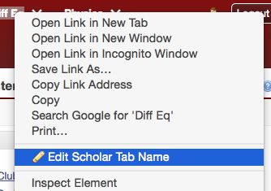
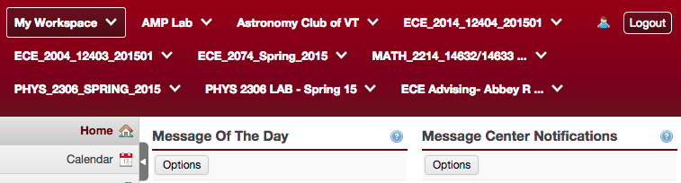
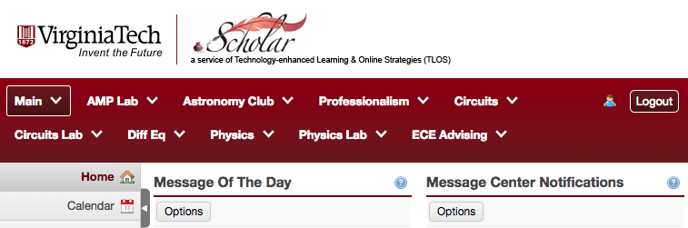

# [Scholar](https://scholar.vt.edu/portal) tab renamer

I got annoyed with always needing to think so hard about the mapping between
the names I know courses by, and the CRNs or 4-digit course numbers scholar
shows them as.
It's rather annoying when you're really busy getting work done and that poor
UI design breaks your flow.

Usage
-----

To rename a tab, just right click it and select `Edit Scholar Tab Name`.

To reset the tab back to its original name, just set it to an empty name.

Before
------

After
-----

Attribution
-----------

scholar-128.png is derived from [this file from Scholar itself](https://scholar.vt.edu/library/skin/neo-default/images/logo_inst.gif).

pencil-16.png is from Mark James' iconic [silk icon set](http://www.famfamfam.com/lab/icons/silk/), used under the Creative Commons Attribution License.
